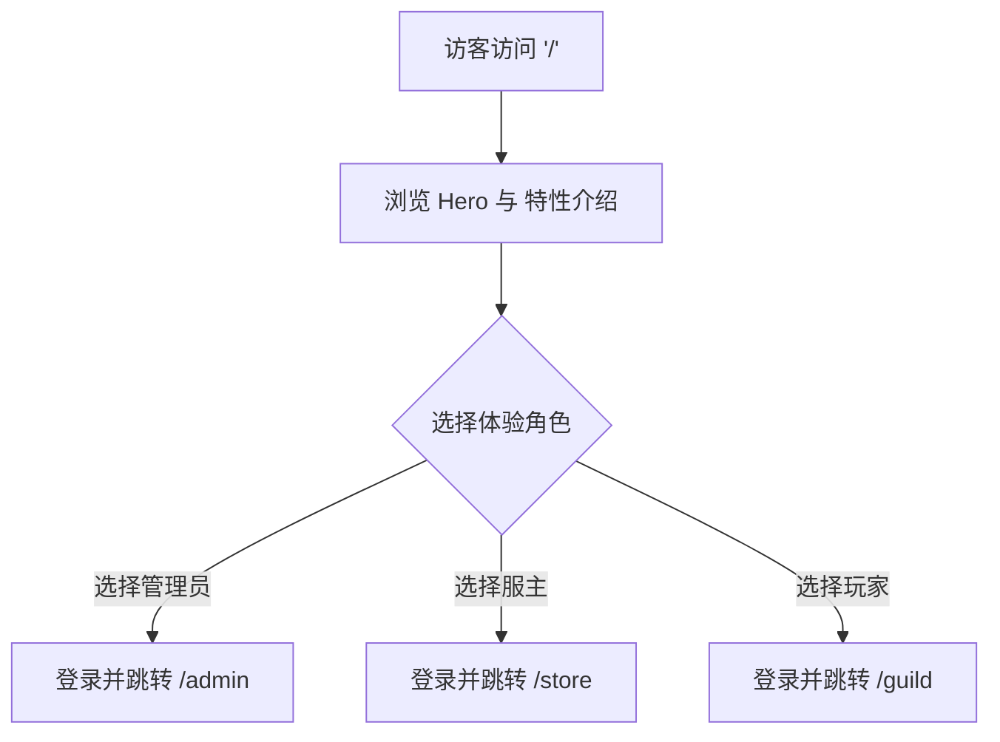

## 1. 产品概述
GameServer Panel (GSP) 全新官方主页，旨在作为一个极具视觉冲击力的产品展示与营销页面。
- 解决当前页面过于简陋、像后台而不想官网的问题。
- 向访客（系统管理员、服主、玩家）全面介绍 GSP 作为“游戏私服领域 Shopify”的强大能力，并提供体验模式的快捷入口。

## 2. 核心叙事与功能展示

### 2.1 叙事视角与逻辑层级 (需求驱动的自下而上)
首页的叙事必须完全抛弃“技术架构”的枯燥展示，而是紧紧围绕**“好玩 -> 好赚 -> 好稳”**的需求逻辑。因为**只有玩家愿意来，服主才会去建服；只有服主能赚到钱，平台（系统管理员）才能存活。**

1. **第一层（乐趣驱动 - 普通玩家视角）：“这个平台太好玩了！”**
   - **痛点打击**：仅仅是连个 IP 进去打怪太无聊了？
   - **直观展示**：在网页上就能逛游戏内商店、购买酷炫道具（Shopping）；看谁不爽直接发起“玩家民主投票踢人”（Vote to Kick）；实时查看谁在线上、查看公会动态。
   - **视觉重点**：动态的商品卡片、有趣的投票进度条、热闹的聊天弹幕流。让玩家一看就觉得：“我想在这个服里玩！”

2. **第二层（利益驱动 - 实例运维/服主视角）：“有了这么多玩家，我该怎么管理和变现？”**
   - **痛点打击**：玩家多了管不过来？想赚点服务器电费却不知怎么弄？
   - **直观展示**：因为第一层吸引了大量玩家，这里提供给服主“开箱即用”的商业化能力（商品上架、CDK生成）和极简运维（一键换图、一键装Mod）。
   - **视觉重点**：订单流水图表、一键部署的绿色成功提示、商品定价的后台 UI 截图。

3. **第三层（底盘支撑 - 系统管理员视角）：“如何支撑起成千上万个这样的生态？”**
   - **痛点打击**：平台规模大了，服务器怎么管？安全怎么防？
   - **直观展示**：在吸引了玩家和服主后，平台管理员需要的是分布式集群、RCON 指令安全沙箱、极低延迟的 WebSocket 隧道。
   - **视觉重点**：酷炫的全球节点拓扑连线、绿色的健康状态监控球。

### 2.2 功能模块设计
1. **Hero 首屏 (Hook)**: 极具冲击力的标题，如“不只是服务器，更是你的数字游乐场”。配以玩家视角的商店和投票界面动效图，直接用“有趣”留住访客。
2. **Fun Features Bento (玩家视角网格)**: 
   - 采用不对称卡片（Bento Grid），直观展示玩家最爱的功能：**精美商城购买**、**民主投票系统**、**实时网页聊天**。
3. **Monetization & Ops (服主视角)**: 
   - “将流量转化为价值”。展示可视化面板、商品配置、财务流水。
4. **Architecture (平台视角)**: 
   - 位于页面底部，用内敛但极具科技感的动画展示 Panel-Daemon 集群架构。
5. **Experience 体验入口**:
   - 玩家（立刻畅玩）、服主（立刻开服）、管理员（掌控全局）三个层次分明的快捷体验入口。

### 2.3 页面详情
| 页面名称 | 模块名称 | 功能描述 |
|----------|----------|----------|
| Landing (主页) | Hero Section | 大屏视觉，炫酷的动态背景，渐变排版，引导点击体验 |
| Landing (主页) | Features Grid | 介绍 Panel-Daemon 架构和商业化生态，辅以精美图标和动效 |
| Landing (主页) | Quick Login | 保留此前的三个体验账号快捷登录卡片，但UI需极致重构并融入整体设计 |

## 3. 核心流程
主要为单向的营销浏览流与入口分发流。

## 4. 用户界面设计

### 4.1 设计风格
- **整体调性**: 暗黑科技风 (Dark Mode / Cyberpunk / Premium SaaS)，奢华且充满未来感。
- **色彩规范**: 
  - 背景：深邃的极黑 (Zinc-950) 配合深邃的网格或噪点纹理。
  - 主色调：霓虹蓝 (Blue-500) 到 紫色 (Purple-500) 的渐变流光。
  - 辅助色：绿宝石 (Emerald-500) 用于强调服主生态。
- **排版 (Typography)**: 大量使用高对比度的无衬线字体，标题使用极粗的字重与渐变填充，增加字距。
- **动效 (Motion)**: 使用 Framer Motion 实现滚动进入（Scroll Reveal）、悬浮发光（Glow Hover）以及丝滑的微交互过渡。
- **布局 (Layout)**: 突破常规对称限制，使用现代 Web 的非对称网格（Bento Grid），保留大量的留白呼吸感。

### 4.2 页面设计概览
| 页面名称 | 模块名称 | UI 元素 |
|----------|----------|---------|
| Landing | Hero | 居中大标题，发光背景球 (Glowing orbs)，玻璃拟态 (Glassmorphism) 导航栏 |
| Landing | Bento Features | 大小不一的卡片拼图，展示 Dashboard 截图或高亮图标，卡片带微弱发光边框 |
| Landing | Experience Cards| 三个具有独特品牌色的3D感悬浮卡片，点击带有下压反馈与加载动画 |

### 4.3 响应式设计
- 桌面端优先 (Desktop-first)，通过多栏网格展示气势。
- 移动端适配为单列流式布局，保留核心动效但减少性能开销。
