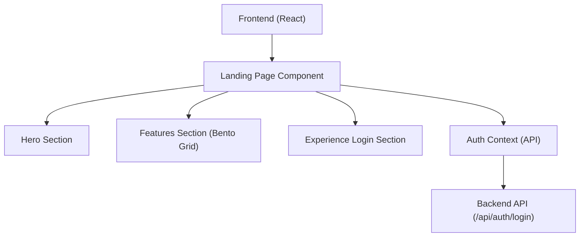

## 1. 架构设计

## 2. 技术说明
- **前端框架**: React 19 + Vite
- **样式方案**: Tailwind CSS v4 (基于当前项目配置)
- **动效库**: `framer-motion` (需引入，用于实现复杂的页面滚动动画和元素微交互，提升“炫酷”感)
- **图标库**: `lucide-react`
- **图标与装饰**: 使用 CSS 径向渐变 (Radial Gradients) 和背景模糊 (Backdrop Blur) 实现玻璃拟态。

## 3. 路由定义
由于在已有的单页应用中开发，路由无需新增，直接覆盖已有的 `/landing` 和 `/` 的默认组件即可。
| 路由 | 目标组件 | 用途 |
|------|----------|------|
| `/` (未登录状态) | `<Landing />` | 展示全新的酷炫主页 |

## 4. 组件划分 (Frontend)
1. **`Landing.tsx`**: 页面容器，负责组合各子组件并提供统一的深色背景底底盘。
2. **`components/landing/Hero.tsx`**: 首屏组件，负责动画文字、光晕背景。
3. **`components/landing/FeatureGrid.tsx`**: 采用 Bento 风格的特性展示区。
4. **`components/landing/ExperienceSection.tsx`**: 融合原有的快捷体验登录逻辑（调用 `useAuth` 的 `login`）。
5. **`components/landing/BackgroundEffects.tsx`**: 纯视觉的 CSS 动态网格与光效层。

## 5. 依赖更新需求
- 需要安装 `framer-motion` (如尚未安装) 以支撑高品质动画。
- 命令: `npm install framer-motion` (在 `panel/frontend` 目录下执行)
