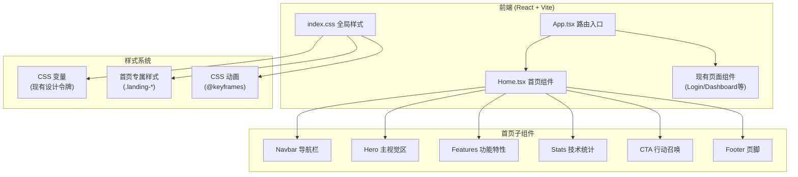

# Factorio Server Manager - 项目首页技术架构文档

## 1. 架构设计

首页作为现有 React 前端应用的新增页面，将完全集成到现有技术栈中，不引入新的外部依赖。



## 2. 技术说明

- **前端框架**：React 19 + TypeScript（与现有项目一致）
- **构建工具**：Vite 6（与现有项目一致）
- **路由**：React Router DOM 7（与现有项目一致）
- **图标库**：Lucide React（项目已安装，版本 ^1.21.0）
- **样式方案**：纯 CSS（使用现有 CSS 变量系统，在 index.css 中添加首页专属样式）
- **状态管理**：使用现有 AuthContext 判断登录状态
- **新增依赖**：无

## 3. 路由定义

| 路由 | 用途 | 访问控制 |
|------|------|---------|
| `/` | 根路径，已登录跳转控制台，未登录展示首页 | 条件渲染 |
| `/home` | 首页直接访问路径（公开路由） | 公开访问 |
| `/login` | 登录页（已有） | 公开访问 |

### 路由逻辑调整

1. 新增 `PUBLIC_ROUTES` 包含 `/home`
2. 根路径 `/` 的处理逻辑：
   - 已登录：渲染 `<Dashboard />`（现有行为）
   - 未登录：重定向到 `/home` 展示首页
3. 首页 `/home` 作为公开路由，不显示侧边栏
4. 登录后默认跳转回控制台 `/`

## 4. 文件结构

```
frontend/src/
├── pages/
│   └── Home.tsx              # 新增：项目首页组件
├── App.tsx                   # 修改：调整路由逻辑
└── index.css                 # 修改：添加首页样式
```

## 5. 组件设计

### 5.1 Home.tsx 组件结构

```tsx
// Home.tsx 单文件组件，包含所有子区块
export default function Home() {
  return (
    <div className="landing-page">
      <Navbar />
      <Hero />
      <Features />
      <Stats />
      <CTA />
      <Footer />
    </div>
  );
}
```

### 5.2 功能特性数据配置

```tsx
const features = [
  { icon: Server, title: '多实例管理', desc: '...' },
  { icon: Activity, title: '实时监控', desc: '...' },
  { icon: Package, title: 'Mod 管理', desc: '...' },
  { icon: Users, title: '玩家管理', desc: '...' },
  { icon: Database, title: '存档备份', desc: '...' },
  { icon: ShoppingBag, title: '商城系统', desc: '...' },
];
```

## 6. 样式架构

### 6.1 CSS 类名命名空间

所有首页样式使用 `.landing-` 前缀，避免与现有样式冲突：

- `.landing-page` - 首页根容器
- `.landing-nav` - 导航栏
- `.landing-hero` - 主视觉区
- `.landing-features` - 功能特性区
- `.landing-stats` - 统计展示区
- `.landing-cta` - 行动召唤区
- `.landing-footer` - 页脚

### 6.2 复用现有设计令牌

- 颜色变量：`--primary`, `--info`, `--bg-base`, `--bg-surface` 等
- 圆角变量：`--radius-lg`, `--radius-xl` 等
- 过渡变量：`--transition-base`, `--ease-out` 等
- 阴影变量：`--shadow-lg`, `--shadow-glow` 等

### 6.3 新增动画

- `@keyframes float` - 浮动装饰元素动画
- `@keyframes glow-pulse` - 光晕呼吸动画
- `@keyframes gradient-shift` - 渐变背景缓慢移动
- `@keyframes fade-in-up` - 元素进入视口淡入上浮
- `@keyframes slide-in` - 交错进入动画

## 7. 响应式断点

复用现有响应式策略，新增首页专属响应式规则：

```css
/* 桌面端优先 */
@media (max-width: 1024px) { /* 平板 */ }
@media (max-width: 768px) { /* 移动端 */ }
```

## 8. 集成要点

1. **AuthContext 集成**：首页顶部导航可根据登录状态显示不同按钮（登录/控制台）
2. **路由守卫调整**：修改 `PrivateRoute` 和根路径重定向逻辑
3. **公开路由列表更新**：将 `/home` 添加到 `PUBLIC_ROUTES`
4. **版本号更新**：本次为新增功能，中版本号递增（当前 v2.0.0 → v2.1.0）
5. **无数据库变更**：纯前端页面，无需迁移脚本
