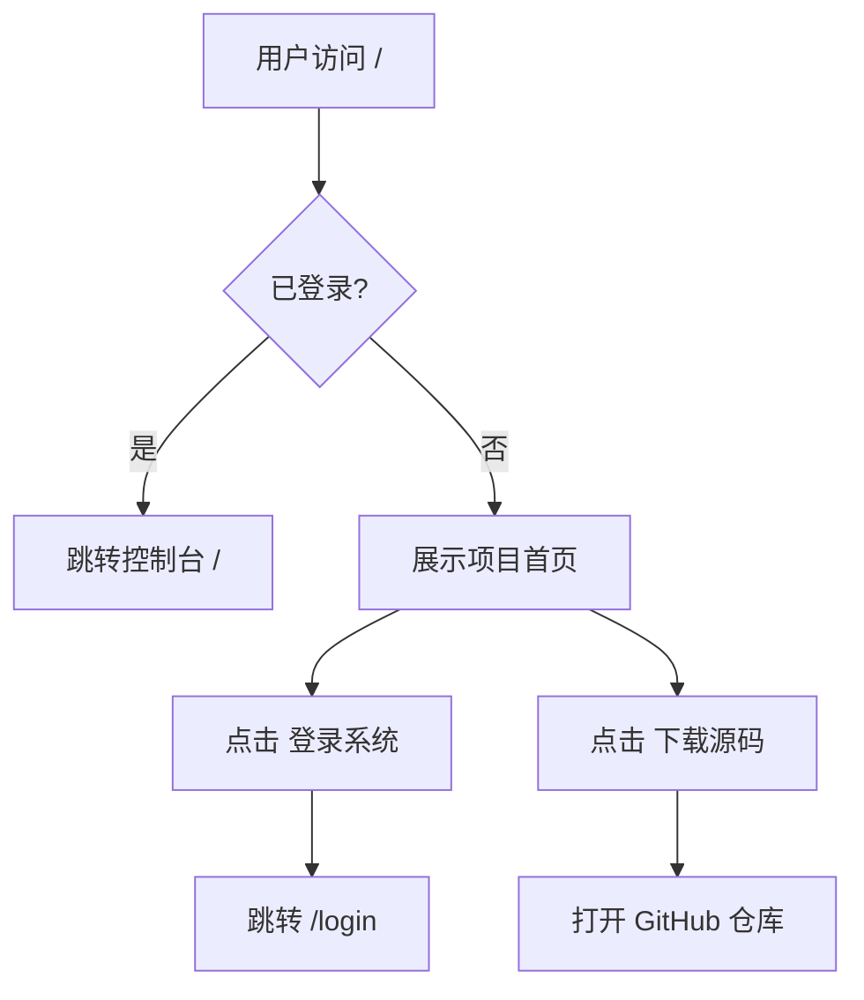

# Factorio Server Manager - 项目首页产品需求文档 (PRD)

## 1. 产品概述

Factorio Server Manager 是一个专业的异星工厂 (Factorio) 游戏服务器管理面板，提供多实例管理、实时监控、Mod管理、玩家管理、存档备份、商城系统等一站式解决方案。本需求旨在设计一个高质量的项目展示首页，替代当前直接展示登录界面的设计，提升项目专业形象，吸引新用户了解并使用。

* 目标用户：Factorio 服务器管理员、游戏社区运营者、多人游戏玩家

* 核心价值：让 Factorio 服务器管理变得简单、直观、高效，无需命令行即可完成所有管理操作

## 2. 核心功能

### 2.1 功能模块

1. **项目首页 (Landing Page)**：核心价值展示区、功能介绍模块、行动引导、页脚导航

### 2.2 页面详情

| 页面名称 | 模块名称      | 功能描述                             |
| ---- | --------- | -------------------------------- |
| 项目首页 | 导航栏       | 项目 Logo、功能导航、登录按钮                |
| 项目首页 | Hero 主视觉区 | 大标题、副标题、动态背景、双 CTA 按钮（登录系统、下载源码） |
| 项目首页 | 功能特性区     | 6个核心功能卡片，图文结合展示多实例管理、实时监控、Mod管理等 |
| 项目首页 | 技术展示区     | 展示技术栈、性能数据、版本信息                  |
| 项目首页 | 行动召唤区     | 再次强调核心价值，引导用户登录或查看源码             |
| 项目首页 | 页脚        | 版权信息、链接导航                        |

## 3. 核心流程

用户访问网站根路径 `/` 时：

* 未登录用户：展示项目首页，而非直接跳转登录页

* 已登录用户：直接跳转到控制台 `/dashboard`

* 用户点击"登录系统"：跳转至登录页

* 用户点击"下载源码"：打开 GitHub 仓库链接

## 4. 用户界面设计

### 4.1 设计风格

* **主题风格**：深色工业科技风，与现有后台管理面板保持一致的设计语言

* **主色调**：橙色 (#f97316) 作为主色，青色 (#06b6d4) 作为辅助色，深色背景 (#0f1117)

* **按钮风格**：圆角按钮，主按钮使用橙色渐变，次按钮使用深色边框样式，带悬停发光效果

* **字体**：标题使用粗体无衬线字体，正文使用清晰易读的系统字体栈

* **布局风格**：全宽区块式布局，大间距、分层设计，卡片式功能展示

* **视觉元素**：动态渐变背景、粒子/网格效果、几何装饰、微妙的动画过渡

### 4.2 页面设计概览

| 页面名称 | 模块名称   | UI 元素                                         |
| ---- | ------ | --------------------------------------------- |
| 项目首页 | 导航栏    | 固定顶部，半透明毛玻璃效果，滚动时背景加深                         |
| 项目首页 | Hero 区 | 大标题（渐变文字）、副标题、浮动装饰元素、动态渐变光晕背景、双按钮并排           |
| 项目首页 | 功能特性   | 响应式网格布局（3列桌面，2列平板，1列移动端），图标+标题+描述卡片，悬停上浮+发光效果 |
| 项目首页 | 技术展示   | 深色背景区块，大数字统计展示，技术栈图标列表                        |
| 项目首页 | CTA 区  | 渐变背景区块，居中大标题，双按钮                              |
| 项目首页 | 页脚     | 深色背景，简洁版权信息，链接列表                              |

### 4.3 响应式设计

* **桌面端 (≥1024px)**：完整三列布局，大尺寸标题和间距，丰富的装饰元素

* **平板端 (768px-1023px)**：两列功能卡片，适当缩小标题和间距

* **移动端 (<768px)**：单列布局，汉堡菜单导航（如需要），紧凑间距，按钮全宽

### 4.4 动画与交互

* 页面加载：元素依次淡入上浮动画

* 滚动触发：功能卡片进入视口时淡入

* 悬停效果：卡片上浮、边框发光、图标微动

* 背景效果：缓慢移动的渐变光晕，营造科技氛围

* 按钮交互：悬停上浮 + 阴影加深 + 发光效果

### 4.5 性能优化

* 纯 CSS 动画，避免 JavaScript 动画库依赖

* 使用 CSS transform 和 opacity 实现高性能动画

* 背景效果使用 CSS 渐变和伪元素，不使用图片

* 图标使用 Lucide React（项目已有依赖）

* 响应式图片/资源按需加载

