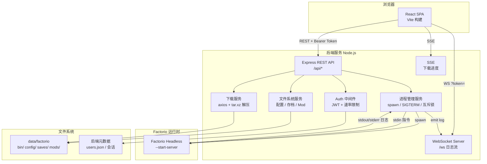
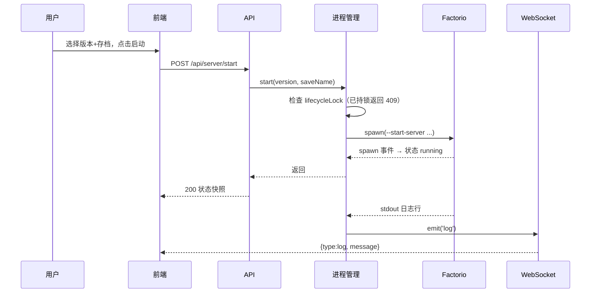
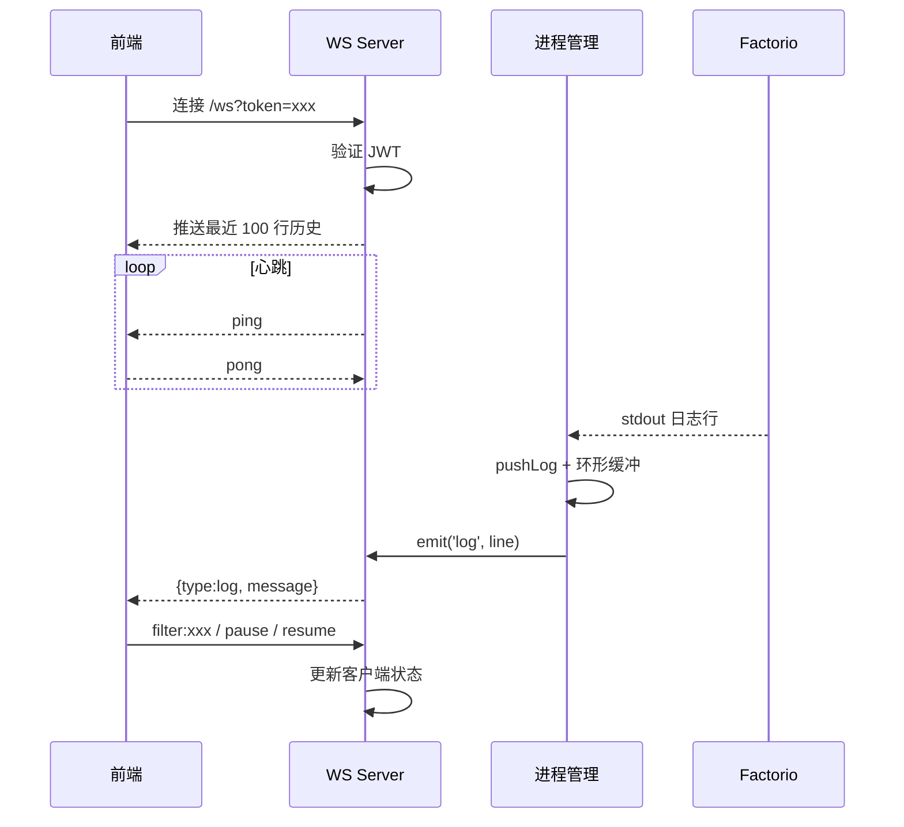
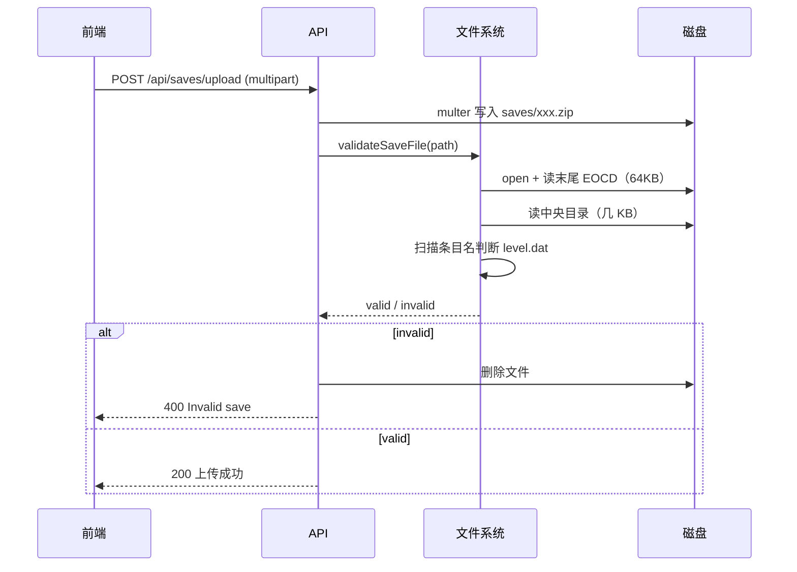
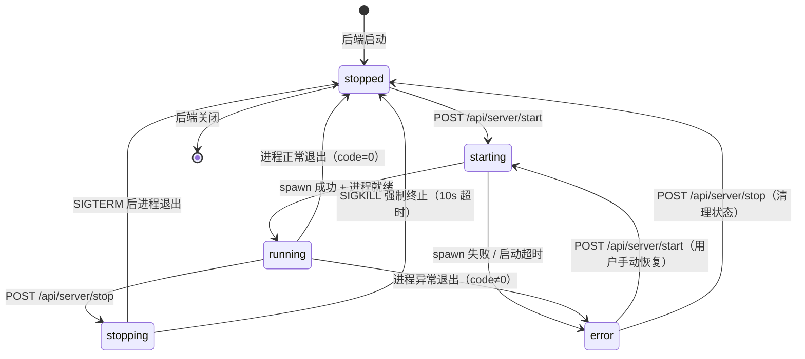

# Factorio 服务端 Web 管理面板 Spec

## Why
目前用户需要通过命令行手动下载、配置、启动、维护 Factorio headless 服务端，存在门槛高、可观测性差、操作易错等问题。需要构建一个前后端分离的 Web 可视化面板，让用户在浏览器中完成 Factorio 服务端的全生命周期管理。

## What Changes
- 新增 Web 前端：提供下载、配置、启动/停止、日志、指令、存档/Mod 管理的可视化界面。
- 新增后端服务：负责与 Factorio headless 进程交互、文件系统管理、进程生命周期管理、向前端推送实时数据。
- 新增数据持久化：服务端实例元数据、配置快照、日志索引、用户/会话信息。
- 新增安全与权限：登录认证、操作审计、敏感配置保护。
- **BREAKING**: 无（全新功能，不破坏现有代码）。

## Impact
- Affected specs: 无现有相关 spec。
- Affected code: 新建前后端项目结构，后端使用 Linux 兼容的文件/进程 API，前端为独立 SPA。

---

## 技术决策（已确定）

| 决策项 | 选择 | 原因 |
|--------|------|------|
| 后端框架 | Node.js + Express + TypeScript | 生态成熟，非阻塞 I/O 适合进程管理与实时推送 |
| 前端框架 | React 19 + TypeScript + Vite | 组件化开发，Vite 构建快，开发体验好 |
| 认证机制 | JWT（Bearer Token），bcryptjs 密码哈希 | 无状态，适合前后端分离；密码不可逆存储 |
| 日志推送 | WebSocket（ws 库），JSON 帧格式 | 双向通信，支持 filter/pause/resume 控制 |
| 下载进度 | SSE（Server-Sent Events） | 单向推送，比轮询高效，比 WS 轻量 |
| 指令通道 | 进程 stdin 写入 | 简单直接，无需额外 RCON 端口配置；指令响应通过 stdout 混入日志流，不单独提供输出通道（Phase 2 可引入 RCON 获取结构化返回） |
| 进程管理 | Node.js child_process.spawn | 原生支持，stdout/stderr/exit 事件完整 |
| 文件上传 | multer（磁盘存储），文件类型白名单 | 防止路径穿越，限制大小与扩展名 |
| 数据持久化 | 文件系统（JSON 文件）+ 环境变量 | 方案前期保持简单，无需额外数据库依赖 |
| 包管理 | npm workspaces（monorepo） | 前后端同一仓库，统一依赖安装与脚本 |
| 通信协议 | REST API（JSON）+ WebSocket | REST 用于 CRUD，WS 用于实时流 |
| 跨域方案 | CORS（开发）+ Vite 代理（前端） | 开发环境前后端不同端口，生产环境同域部署 |
| 目标 Factorio 版本 | 1.1.x / 2.0.x（headless Linux x64） | 覆盖当前主流版本 |

---

## 技术栈版本

| 组件 | 版本 |
|------|------|
| Node.js | >= 20.x |
| TypeScript | ^5.7 |
| Express | ^4.21 |
| React | ^19.0 |
| Vite | ^6.1 |
| bcryptjs | ^2.4 |
| jsonwebtoken | ^9.0 |
| ws | ^8.18 |
| axios | ^1.7 |
| multer | ^1.4 |

---

## 系统架构设计

### 架构概览

前后端分离的单体架构：React SPA 通过 REST + WebSocket + SSE 与 Node.js 后端通信，后端通过 `child_process` 管理 Factorio headless 进程，所有数据持久化在文件系统。



### 组件职责

| 组件 | 职责 | 关键依赖 |
|------|------|----------|
| React SPA | 管理界面，持有 JWT，WS 客户端，状态轮询 | axios, React |
| Express REST API | 处理 CRUD，鉴权编排，返回 JSON | express, multer |
| WebSocket Server | 推送实时日志，接收 filter/pause/resume 控制，心跳保活 | ws |
| SSE 端点 | 单向推送下载进度（0-100%） | - |
| Auth 中间件 | JWT 校验、角色校验、登录速率限制（5 次/分钟） | jsonwebtoken, bcryptjs |
| 进程管理服务 | Factorio 生命周期、lifecycleLock 互斥、日志环形缓冲（1000 行） | child_process |
| 文件系统服务 | 配置/存档/Mod 读写、JSON 校验、流式 zip 校验、自动备份 | fs/promises |
| 下载服务 | 异步下载 .tar.xz、解压到 bin/{version}/、进度追踪 | axios, tar |
| Factorio Headless | 游戏服务端，stdin 接收指令，stdout/stderr 输出日志 | - |

### 关键数据流

#### 启动服务端


#### 日志实时推送


#### 存档上传与流式校验


### 目录结构

```
trae/
├── backend/
│   ├── src/
│   │   ├── index.ts              # 入口：Express + WS 启动、心跳、JWT 检查
│   │   ├── routes/               # auth, server, config, saves, mods
│   │   ├── middleware/auth.ts    # JWT + 角色校验
│   │   └── services/             # factorioProcess, downloader
│   ├── .env.example
│   └── package.json
├── frontend/
│   ├── src/
│   │   ├── pages/                # Login, Dashboard, Config, Saves, Mods, Logs
│   │   ├── api/client.ts         # axios 封装 + 拦截器
│   │   └── context/AuthContext.tsx
│   └── package.json
├── data/factorio/                # 运行时数据（gitignore）
│   ├── bin/{version}/            # 解压后的 Factorio 二进制
│   ├── config/                   # server-settings.json 等 + backups/
│   ├── saves/                    # .zip 存档
│   ├── mods/                     # .zip Mod + mod-list.json
│   └── temp/                     # 下载临时文件
└── package.json                  # npm workspaces 根
```

### 架构约束与边界

- **单实例假设**：Phase 1 后端仅管理一个 Factorio 进程，通过 `lifecycleLock` 保证 start/stop/restart 互斥；多实例支持留待 Phase 2。
- **无数据库**：元数据（用户、会话）以 JSON 文件存储，适合单管理员场景；多用户并发写入需在 Phase 2 引入写入锁或数据库。
- **进程隔离**：Factorio 以后台子进程运行（`detached: false`），后端退出时 Factorio 随之终止（不产生孤儿进程）。
- **通信边界**：前端不直接访问文件系统或 Factorio 进程，所有操作经后端 API；WebSocket 仅用于日志流，不承载控制指令。

---

## 状态机设计

Factorio 进程生命周期状态机定义如下：



### 合法状态转换表

| 当前状态 | 目标状态 | 触发条件 | 副作用 |
|----------|----------|----------|--------|
| `stopped` | `starting` | `POST /api/server/start` | 检查 lifecycleLock；spawn 进程 |
| `starting` | `running` | spawn 事件 + 首行日志输出 | 释放 lifecycleLock；启动日志推送 |
| `starting` | `error` | spawn 失败 / 30s 超时 | 释放 lifecycleLock；记录 recentError |
| `running` | `stopping` | `POST /api/server/stop` | 持有 lifecycleLock；发送 SIGTERM |
| `running` | `error` | exit 事件 code≠0 | 释放 lifecycleLock；记录 recentError |
| `running` | `stopped` | exit 事件 code=0 | 释放 lifecycleLock；正常清理 |
| `stopping` | `stopped` | exit 事件 或 SIGKILL 后 | 释放 lifecycleLock；清理句柄 |
| `error` | `starting` | `POST /api/server/start` | 同 stopped→starting |
| `error` | `stopped` | `POST /api/server/stop` | 清理 recentError；释放残留句柄 |

### 非法转换（拒绝并返回 HTTP 409）
- `running` → `starting`（重复启动，由 lifecycleLock 拦截）
- `starting` → `starting`（启动中再次启动）
- `stopping` → `starting`（停止中不允许启动，需等待停止完成）

### 状态字段定义
```typescript
interface ServerStatus {
  state: 'stopped' | 'starting' | 'running' | 'stopping' | 'error';
  pid: number | null;           // 进程 PID，stopped/error 时为 null
  version: string | null;       // Factorio 版本
  saveName: string | null;      // 当前存档名
  startedAt: number | null;     // 启动时间戳（ms），stopped 时为 null
  recentError: string | null;   // 最近错误信息，仅 error 状态
  uptime: number;               // 运行时长（秒），由 running 状态计算
}
```

---

## 数据结构定义

本章节定义系统中所有核心数据结构，作为前后端开发的契约依据。

### 持久化数据结构

#### `users.json` — 用户表
```json
{
  "users": [
    {
      "id": "u_1700000000000",
      "username": "admin",
      "passwordHash": "$2a$10$N9qo8uLOickgx2ZMRZoMy...",
      "role": "admin",
      "createdAt": 1700000000000,
      "lastLoginAt": 1700000000000
    }
  ]
}
```

| 字段 | 类型 | 必填 | 说明 |
|------|------|------|------|
| `id` | string | 是 | 用户 ID，格式 `u_{timestamp}` |
| `username` | string | 是 | 用户名，唯一，3-32 字符 |
| `passwordHash` | string | 是 | bcrypt 哈希（salt rounds=10） |
| `role` | `"admin"` \| `"user"` | 是 | 角色，初始管理员由环境变量创建 |
| `createdAt` | number | 是 | 创建时间戳（ms） |
| `lastLoginAt` | number | 否 | 最近登录时间戳（ms） |

#### `instances.json` — 实例表（Phase 2）
```json
{
  "instances": [
    {
      "id": "inst_a1b2c3",
      "name": "主服务器",
      "version": "2.0.0",
      "port": 34197,
      "saveName": "world1.zip",
      "state": "stopped",
      "createdAt": 1700000000000,
      "lastStartedAt": null
    }
  ]
}
```

| 字段 | 类型 | 必填 | 说明 |
|------|------|------|------|
| `id` | string | 是 | 实例 ID，格式 `inst_{6位随机}` |
| `name` | string | 是 | 实例显示名，1-64 字符 |
| `version` | string | 是 | Factorio 版本 |
| `port` | number | 是 | 游戏 UDP 端口，1024-65535 |
| `saveName` | string | 否 | 默认存档名 |
| `state` | string | 是 | 同 `ServerStatus.state` |
| `createdAt` | number | 是 | 创建时间戳（ms） |
| `lastStartedAt` | number | 否 | 最近启动时间戳（ms） |

#### 下载任务对象（内存，不持久化）
```typescript
interface DownloadTask {
  id: string;                    // 任务 ID，格式 `dl_{timestamp}_{random}`
  version: string;               // 目标 Factorio 版本
  state: 'pending' | 'downloading' | 'extracting' | 'done' | 'error';
  progress: number;              // 0-100
  totalBytes: number;            // 总字节数（Content-Length）
  downloadedBytes: number;       // 已下载字节数
  error: string | null;          // 错误信息
  startedAt: number;             // 开始时间戳（ms）
  completedAt: number | null;    // 完成时间戳（ms）
}
```

### 通信协议数据结构

#### WebSocket 消息格式

**服务端 → 客户端**：
```json
// 日志推送
{"type": "log", "message": "2026-01-01 12:00:00 [INFO] Server started", "timestamp": 1700000000000}

// 历史日志批量推送（连接后立即发送）
{"type": "history", "messages": ["line1", "line2", "..."], "count": 100}

// 心跳响应
{"type": "pong"}

// 错误
{"type": "error", "message": "Invalid command", "code": "WS_INVALID_COMMAND"}

// 连接确认
{"type": "connected", "message": "WebSocket connected, 100 history lines sent"}
```

**客户端 → 服务端**：
```json
// 关键字过滤（不区分大小写）
{"type": "filter", "value": "error"}

// 清除过滤
{"type": "filter", "value": ""}

// 暂停推送
{"type": "pause"}

// 恢复推送
{"type": "resume"}

// 心跳
{"type": "ping"}
```

| 消息类型 | 方向 | 字段 | 说明 |
|----------|------|------|------|
| `log` | S→C | `message`, `timestamp` | 单行日志推送 |
| `history` | S→C | `messages[]`, `count` | 连接后批量推送历史 |
| `pong` | S→C | - | 心跳响应 |
| `error` | S→C | `message`, `code` | 协议错误 |
| `connected` | S→C | `message` | 连接确认 |
| `filter` | C→S | `value` | 设置/清除过滤关键字 |
| `pause` | C→S | - | 暂停推送 |
| `resume` | C→S | - | 恢复推送 |
| `ping` | C→S | - | 心跳请求 |

#### SSE 事件格式（下载进度）

```
event: progress
data: {"downloadId":"dl_1700000000000_abc","state":"downloading","progress":45,"downloadedBytes":524288000,"totalBytes":1165000000,"speed":5242880}

event: progress
data: {"downloadId":"dl_1700000000000_abc","state":"extracting","progress":100}

event: done
data: {"downloadId":"dl_1700000000000_abc","state":"done","version":"2.0.0"}

event: error
data: {"downloadId":"dl_1700000000000_abc","state":"error","error":"Network timeout"}
```

| 事件类型 | 触发时机 | data 字段 |
|----------|----------|-----------|
| `progress` | 下载/解压中每秒推送 | `downloadId`, `state`, `progress`, `downloadedBytes`, `totalBytes`, `speed` |
| `done` | 下载+解压完成 | `downloadId`, `state`, `version` |
| `error` | 下载/解压失败 | `downloadId`, `state`, `error` |

### API 统一响应格式

#### 成功响应
```json
{
  "data": <任意类型或 null>,
  "message": "操作成功"
}
```
- `data`：响应数据，无数据时为 `null`
- `message`：人类可读的成功消息（可选）

#### 错误响应
```json
{
  "error": "人类可读的错误描述",
  "details": ["可选的详细错误列表（如校验字段）"],
  "code": "可选的机器可读错误码"
}
```

#### 错误码表

| 错误码 | HTTP 状态 | 说明 |
|--------|-----------|------|
| `AUTH_MISSING_TOKEN` | 401 | 请求未携带 Authorization 头 |
| `AUTH_INVALID_TOKEN` | 401 | token 无效或过期 |
| `AUTH_INVALID_CREDENTIALS` | 401 | 用户名或密码错误 |
| `AUTH_ADMIN_REQUIRED` | 403 | 需要管理员权限 |
| `SERVER_NOT_RUNNING` | 400 | 服务端未运行 |
| `SERVER_ALREADY_RUNNING` | 409 | 服务端已在运行或启动中 |
| `SERVER_NO_SAVE` | 400 | 无可用存档 |
| `SERVER_BINARY_NOT_FOUND` | 404 | 指定版本二进制不存在 |
| `DOWNLOAD_DUPLICATE` | 409 | 该版本正在下载中 |
| `DOWNLOAD_NOT_FOUND` | 404 | 下载任务不存在 |
| `SAVE_NOT_FOUND` | 404 | 存档不存在 |
| `SAVE_INVALID` | 400 | 存档校验失败（无 level.dat） |
| `SAVE_INVALID_NAME` | 400 | 存档名非法（非 .zip 或路径穿越） |
| `MOD_NOT_FOUND` | 404 | Mod 不存在 |
| `MOD_INVALID_FORMAT` | 400 | Mod 文件名格式错误（非 `{name}_{version}.zip`） |
| `CONFIG_NOT_FOUND` | 404 | 配置文件不存在 |
| `CONFIG_INVALID` | 400 | 配置校验失败 |
| `RATE_LIMIT_EXCEEDED` | 429 | 触发速率限制 |
| `INSTANCE_PORT_CONFLICT` | 409 | 实例端口冲突（Phase 2） |
| `INTERNAL_ERROR` | 500 | 服务器内部错误 |

### 日志缓冲区结构

```typescript
class LogBuffer {
  private buffer: string[];        // 环形数组
  private capacity: number;        // 容量，默认 1000（由 MAX_LOG_LINES 配置）
  private head: number;            // 写入位置
  private size: number;            // 当前元素数

  // 方法
  push(line: string): void;        // 写入一行
  recent(n: number): string[];     // 获取最近 n 行
  filter(keyword: string): string[]; // 按关键字过滤
  clear(): void;                   // 清空
}
```

### 配置文件 Schema

#### `server-settings.json` 字段校验规则

| 字段 | 类型 | 必填 | 校验规则 | 默认值 |
|------|------|------|----------|--------|
| `name` | string | 是 | 1-100 字符 | "Factorio Server" |
| `description` | string | 否 | 0-200 字符 | "" |
| `tags` | string[] | 否 | 每项 1-50 字符，最多 10 项 | [] |
| `max_players` | number | 否 | 整数，0-65535（0=无限） | 0 |
| `visibility` | object | 否 | `{public: boolean, lan: boolean}` | `{public:true, lan:true}` |
| `username` | string | 否 | 0-50 字符 | "" |
| `token` | string | 否 | 0-100 字符（**API 返回脱敏**） | "" |
| `game_password` | string | 否 | 0-100 字符（**API 返回脱敏**） | "" |
| `require_user_verification` | boolean | 否 | - | true |
| `max_upload_in_kilobytes_per_second` | number | 否 | 整数，0-100000 | 0 |
| `max_upload_slots` | number | 否 | 整数，1-255 | 5 |
| `minimum_latency_in_ticks` | number | 否 | 整数，0-1000 | 0 |
| `max_heartbeats_per_second` | number | 否 | 整数，1-1000 | 60 |
| `ignore_player_limit_for_returning_players` | boolean | 否 | - | false |
| `allow_commands` | string | 否 | 枚举 `"true"` \| `"false"` \| `"admins-only"` | "admins-only" |
| `autosave_interval` | number | 否 | 整数，0-3600（秒，0=禁用） | 600 |
| `autosave_slots` | number | 否 | 整数，1-100 | 5 |
| `afk_autokick_interval` | number | 否 | 整数，0-86400（秒，0=禁用） | 0 |
| `auto_pause` | boolean | 否 | - | true |
| `only_admins_can_pause_the_game` | boolean | 否 | - | true |
| `autosave_only_on_server` | boolean | 否 | - | true |
| `non_blocking_saving` | boolean | 否 | - | false |
| `max_puzzle_pieces` | number | 否 | 整数，>0 | 4096 |

#### 其他配置文件
- `map-gen-settings.json`、`map-settings.json`：Phase 1 仅做 JSON 格式校验，详细字段校验留待后续（见 [checklist.md:39](file:///d:/trae/.trae/specs/build-factorio-server-manager/checklist.md#L39)）
- `mod-list.json`：格式 `{"mods": [{"name": "string", "enabled": boolean}]}`，仅校验数组结构与必填字段

---

## API 契约概要

### 路由结构

```
/api/auth
  POST /login          — 登录，返回 JWT token
  POST /logout         — 登出
  GET  /me             — 获取当前用户信息

/api/server
  GET  /status                      — 服务端运行状态
  GET  /logs?count=N&filter=xxx     — 历史日志
  POST /start      {version, saveName?}  — 启动
  POST /stop                          — 停止
  POST /restart   {version?, saveName?} — 重启
  POST /command   {command}            — 发送控制台指令
  GET  /versions                       — 已下载版本列表
  POST /download  {version}            — 发起下载
  GET  /download/:id/status            — 下载任务状态
  GET  /download/:id/progress          — SSE 下载进度流

/api/config
  GET  /:name          — 读取配置
  POST /:name          — 保存配置（自动备份）
  POST /:name/import   — 导入配置（multipart）
  GET  /:name/export   — 导出配置（下载文件）

/api/saves
  GET  /                     — 存档列表
  POST /upload               — 上传存档（multipart）
  GET  /:name/download       — 下载存档
  DELETE /:name              — 删除存档
  POST /:name/rename         — 重命名存档
  GET  /:name/validate       — 校验存档有效性

/api/mods
  GET  /                     — Mod 列表
  POST /upload               — 上传 Mod（multipart）
  DELETE /:name              — 删除 Mod
  POST /:name/toggle         — 启用/禁用 Mod
  POST /sync                 — 同步 mod-list.json 与文件系统

/api/health                  — 健康检查

/ws?token=xxx                — WebSocket 日志流（JWT 认证）
```

### 认证方式
- REST API：`Authorization: Bearer <token>` 请求头
- WebSocket：URL 查询参数 `?token=<token>`
- 所有管理接口（除 `/api/auth/login` 与 `/api/health`）均需认证
- 写操作（启动/停止/下载/配置修改等）额外要求 `admin` 角色

### 错误响应格式
见 [数据结构定义 → API 统一响应格式 → 错误响应](#api-统一响应格式) 与 [错误码表](#错误码表)。

---

## 接口规范详解

> 以下为每个接口的详细规范。所有响应体遵循 [API 统一响应格式](#api-统一响应格式)。

### 认证模块

#### `POST /api/auth/login`
登录并获取 JWT token。

- **认证**：无（公开接口）
- **速率限制**：5 次/分钟/IP（`RATE_LIMIT_LOGIN_PER_MIN`）
- **请求体**：
  ```json
  {
    "username": "admin",
    "password": "明文密码"
  }
  ```
  | 字段 | 类型 | 必填 | 校验 |
  |------|------|------|------|
  | `username` | string | 是 | 3-32 字符 |
  | `password` | string | 是 | 1-100 字符 |
- **成功响应** `200`：
  ```json
  {
    "data": {
      "token": "eyJhbGciOiJIUzI1NiIs...",
      "user": {
        "id": "u_1700000000000",
        "username": "admin",
        "role": "admin"
      }
    },
    "message": "登录成功"
  }
  ```
- **错误响应**：
  | 状态码 | 错误码 | 说明 |
  |--------|--------|------|
  | 401 | `AUTH_INVALID_CREDENTIALS` | 用户名或密码错误 |
  | 429 | `RATE_LIMIT_EXCEEDED` | 触发速率限制 |

#### `POST /api/logout`
登出（前端清除 token，后端无状态无需记录）。

- **认证**：需要
- **请求体**：无
- **成功响应** `200`：
  ```json
  { "data": null, "message": "已登出" }
  ```

#### `GET /api/auth/me`
获取当前登录用户信息（用于刷新页面后恢复登录态）。

- **认证**：需要
- **成功响应** `200`：
  ```json
  {
    "data": {
      "id": "u_1700000000000",
      "username": "admin",
      "role": "admin",
      "createdAt": 1700000000000,
      "lastLoginAt": 1700000000000
    }
  }
  ```
- **错误响应**：401 `AUTH_INVALID_TOKEN`

### 服务端生命周期模块

#### `GET /api/server/status`
获取服务端运行状态。

- **认证**：需要
- **成功响应** `200`：
  ```json
  {
    "data": {
      "state": "running",
      "pid": 12345,
      "version": "2.0.0",
      "saveName": "world1.zip",
      "startedAt": 1700000000000,
      "recentError": null,
      "uptime": 3600
    }
  }
  ```
  - `data` 字段类型见 [ServerStatus](#状态字段定义)

#### `GET /api/server/logs`
查询历史日志。

- **认证**：需要
- **查询参数**：
  | 参数 | 类型 | 必填 | 默认 | 说明 |
  |------|------|------|------|------|
  | `count` | number | 否 | 100 | 返回行数，1-1000 |
  | `filter` | string | 否 | "" | 关键字过滤（不区分大小写） |
- **成功响应** `200`：
  ```json
  {
    "data": {
      "lines": ["2026-01-01 12:00:00 [INFO] Server started", "..."],
      "count": 50,
      "total": 1000
    }
  }
  ```

#### `POST /api/server/start`
启动 Factorio 服务端。

- **认证**：需要 admin
- **请求体**：
  ```json
  {
    "version": "2.0.0",
    "saveName": "world1.zip"
  }
  ```
  | 字段 | 类型 | 必填 | 校验 |
  |------|------|------|------|
  | `version` | string | 是 | 必须为已下载版本（见 `GET /versions`） |
  | `saveName` | string | 否 | 必须为 `saves/` 下已存在的 `.zip`；不传则使用最新存档 |
- **成功响应** `200`：
  ```json
  {
    "data": { "state": "starting", "pid": 12345 },
    "message": "服务端启动中"
  }
  ```
- **错误响应**：
  | 状态码 | 错误码 | 说明 |
  |--------|--------|------|
  | 409 | `SERVER_ALREADY_RUNNING` | 已在运行或启动中 |
  | 404 | `SERVER_BINARY_NOT_FOUND` | 指定版本二进制不存在 |
  | 400 | `SERVER_NO_SAVE` | 无可用存档 |

#### `POST /api/server/stop`
停止 Factorio 服务端（SIGTERM → 10s 超时 → SIGKILL）。

- **认证**：需要 admin
- **请求体**：无
- **成功响应** `200`：
  ```json
  { "data": { "state": "stopping" }, "message": "服务端停止中" }
  ```
- **错误响应**：400 `SERVER_NOT_RUNNING`

#### `POST /api/server/restart`
重启服务端（停止 → 启动）。

- **认证**：需要 admin
- **请求体**：
  ```json
  { "version": "2.0.0", "saveName": "world1.zip" }
  ```
  - 两个字段均可选，不传则沿用当前版本与存档
- **成功响应** `200`：
  ```json
  { "data": { "state": "stopping" }, "message": "重启中" }
  ```
- **错误响应**：409 `SERVER_ALREADY_RUNNING`（启动阶段互斥）

#### `POST /api/server/command`
向运行中的 Factorio 发送控制台指令。

- **认证**：需要 admin
- **请求体**：
  ```json
  { "command": "/save" }
  ```
  | 字段 | 类型 | 必填 | 校验 |
  |------|------|------|------|
  | `command` | string | 是 | 1-500 字符，必须以 `/` 开头 |
- **成功响应** `200`：
  ```json
  { "data": null, "message": "指令已发送" }
  ```
  - 指令以 `[command] /save` 形式写入日志流，响应通过 stdout 混入日志流
- **错误响应**：400 `SERVER_NOT_RUNNING`

#### `GET /api/server/versions`
列出已下载的 Factorio 版本。

- **认证**：需要
- **成功响应** `200`：
  ```json
  {
    "data": [
      { "version": "2.0.0", "path": "data/factorio/bin/2.0.0/", "size": 120000000 }
    ]
  }
  ```

#### `POST /api/server/download`
发起下载任务。

- **认证**：需要 admin
- **请求体**：
  ```json
  { "version": "2.0.0" }
  ```
- **成功响应** `200`：
  ```json
  {
    "data": { "downloadId": "dl_1700000000000_abc", "state": "pending" },
    "message": "下载任务已创建"
  }
  ```
- **错误响应**：409 `DOWNLOAD_DUPLICATE`（同版本正在下载）

#### `GET /api/server/download/:id/status`
查询下载任务状态。

- **认证**：需要
- **路径参数**：`id` — 下载任务 ID
- **成功响应** `200`：
  ```json
  {
    "data": {
      "id": "dl_1700000000000_abc",
      "version": "2.0.0",
      "state": "downloading",
      "progress": 45,
      "totalBytes": 1165000000,
      "downloadedBytes": 524288000,
      "error": null,
      "startedAt": 1700000000000,
      "completedAt": null
    }
  }
  ```
- **错误响应**：404 `DOWNLOAD_NOT_FOUND`

#### `GET /api/server/download/:id/progress`
SSE 下载进度流。

- **认证**：需要（token 通过 query 参数传递 `?token=xxx`）
- **响应**：`text/event-stream`，事件格式见 [SSE 事件格式](#sse-事件格式下载进度)
- **关闭**：客户端断开或任务完成（`done`/`error` 事件后服务端关闭流）

### 配置管理模块

#### `GET /api/config/:name`
读取配置文件。

- **认证**：需要
- **路径参数**：`name` — 枚举 `server-settings` \| `map-gen-settings` \| `map-settings` \| `mod-list`
- **成功响应** `200`：
  ```json
  {
    "data": {
      "name": "server-settings",
      "content": { "name": "Factorio Server", "max_players": 0, "..." : "..." },
      "updatedAt": 1700000000000
    }
  }
  ```
  - `server-settings` 的 `token`、`game_password` 字段返回 `***`（脱敏）
- **错误响应**：404 `CONFIG_NOT_FOUND`

#### `POST /api/config/:name`
保存配置（自动备份）。

- **认证**：需要 admin
- **路径参数**：同上
- **请求体**：
  ```json
  { "content": { "name": "My Server", "max_players": 10 } }
  ```
- **成功响应** `200`：
  ```json
  {
    "data": { "backupPath": "config/backups/server-settings-1700000000000.json" },
    "message": "配置已保存"
  }
  ```
- **错误响应**：400 `CONFIG_INVALID`（含 `details` 字段列出校验失败项）

#### `POST /api/config/:name/import`
导入配置文件（multipart 上传）。

- **认证**：需要 admin
- **请求体**：`multipart/form-data`，字段 `file`（JSON 文件，最大 10MB）
- **成功响应** `200`：
  ```json
  { "data": null, "message": "配置已导入" }
  ```
- **错误响应**：400 `CONFIG_INVALID`

#### `GET /api/config/:name/export`
导出配置文件下载。

- **认证**：需要
- **成功响应** `200`：
  - `Content-Type: application/json`
  - `Content-Disposition: attachment; filename="server-settings.json"`
  - 响应体为配置文件原始 JSON（**不脱敏**，含真实 token/password）

### 存档管理模块

#### `GET /api/saves`
列出存档。

- **认证**：需要
- **成功响应** `200`：
  ```json
  {
    "data": [
      {
        "name": "world1.zip",
        "size": 52428800,
        "modifiedAt": 1700000000000,
        "valid": true
      }
    ]
  }
  ```

#### `POST /api/saves/upload`
上传存档（multipart）。

- **认证**：需要 admin
- **请求体**：`multipart/form-data`，字段 `file`（`.zip`，最大 2GB）
- **成功响应** `200`：
  ```json
  { "data": { "name": "world1.zip", "size": 52428800 }, "message": "上传成功" }
  ```
- **错误响应**：
  | 状态码 | 错误码 | 说明 |
  |--------|--------|------|
  | 400 | `SAVE_INVALID` | 校验失败（无 level.dat） |
  | 400 | `SAVE_INVALID_NAME` | 文件名非法 |

#### `GET /api/saves/:name/download`
下载存档。

- **认证**：需要
- **成功响应** `200`：
  - `Content-Type: application/octet-stream`
  - `Content-Disposition: attachment; filename="world1.zip"`
  - 响应体为文件流
- **错误响应**：404 `SAVE_NOT_FOUND`

#### `DELETE /api/saves/:name`
删除存档。

- **认证**：需要 admin
- **成功响应** `200`：
  ```json
  { "data": null, "message": "存档已删除" }
  ```
- **错误响应**：404 `SAVE_NOT_FOUND`

#### `POST /api/saves/:name/rename`
重命名存档。

- **认证**：需要 admin
- **请求体**：
  ```json
  { "newName": "world2.zip" }
  ```
  | 字段 | 类型 | 必填 | 校验 |
  |------|------|------|------|
  | `newName` | string | 是 | 必须以 `.zip` 结尾，`path.basename()` 校验 |
- **成功响应** `200`：
  ```json
  { "data": { "name": "world2.zip" }, "message": "重命名成功" }
  ```

#### `GET /api/saves/:name/validate`
校验存档有效性。

- **认证**：需要
- **成功响应** `200`：
  ```json
  { "data": { "valid": true, "entries": 152 } }
  ```

### Mod 管理模块

#### `GET /api/mods`
列出 Mod。

- **认证**：需要
- **成功响应** `200`：
  ```json
  {
    "data": [
      {
        "name": "krastorio2",
        "version": "2.0.1",
        "fileName": "krastorio2_2.0.1.zip",
        "enabled": true,
        "size": 52428800
      }
    ]
  }
  ```

#### `POST /api/mods/upload`
上传 Mod（multipart）。

- **认证**：需要 admin
- **请求体**：`multipart/form-data`，字段 `file`（`.zip`，最大 100MB，文件名格式 `{name}_{version}.zip`）
- **成功响应** `200`：
  ```json
  {
    "data": { "name": "krastorio2", "version": "2.0.1" },
    "message": "上传成功"
  }
  ```
- **错误响应**：400 `MOD_INVALID_FORMAT`

#### `DELETE /api/mods/:name`
删除 Mod。

- **认证**：需要 admin
- **路径参数**：`name` — Mod 名称（非文件名）
- **成功响应** `200`：
  ```json
  { "data": null, "message": "Mod 已删除" }
  ```
- **错误响应**：404 `MOD_NOT_FOUND`

#### `POST /api/mods/:name/toggle`
启用/禁用 Mod。

- **认证**：需要 admin
- **请求体**：
  ```json
  { "enabled": false }
  ```
- **成功响应** `200`：
  ```json
  { "data": { "name": "krastorio2", "enabled": false }, "message": "状态已更新" }
  ```

#### `POST /api/mods/sync`
同步 `mod-list.json` 与文件系统。

- **认证**：需要 admin
- **请求体**：无
- **成功响应** `200`：
  ```json
  {
    "data": { "added": ["new-mod"], "removed": ["deleted-mod"] },
    "message": "同步完成"
  }
  ```

### 健康检查

#### `GET /api/health`
健康检查（无需认证）。

- **成功响应** `200`：
  ```json
  { "status": "ok" }
  ```
  - 注意：此接口不遵循统一响应格式，直接返回 `{ "status": "ok" }`，便于 Docker healthcheck 或负载均衡探针

### WebSocket 接口

#### `/ws?token=<jwt>`
实时日志流。

- **认证**：URL 参数 `token`，JWT 校验失败时关闭连接（code 1008）
- **消息格式**：见 [WebSocket 消息格式](#websocket-消息格式)
- **心跳**：服务端每 30 秒发送 `ping`，客户端需响应 `pong`；60 秒无响应则断开
- **连接生命周期**：
  1. 客户端连接 → 服务端校验 JWT
  2. 校验通过 → 推送 `connected` 消息 + `history`（最近 100 行）
  3. 持续推送 `log` 消息
  4. 客户端可发送 `filter` / `pause` / `resume` / `ping` 控制消息
  5. 断开时清理客户端状态

---

## 非功能性需求（NFR）

### 性能
- API 响应时间：P95 < 500ms（不含 Factorio 进程启动）
- WebSocket 日志推送延迟：< 1s（从 Factorio 输出到前端显示）
- 日志缓冲区：最近 1000 行，可配置
- 文件上传大小限制：存档 2GB，Mod 100MB，配置导入 10MB

### 安全
- 密码存储：bcrypt，salt rounds = 10
- JWT 过期时间：7 天（可配置）
- JWT 密钥：环境变量注入，提供 fallback 警告
- 文件上传：路径穿越防护（`path.basename()` 校验）、扩展名白名单、大小限制
- 敏感字段：`server-settings.json` 中的 `token`、`game_password` 在 API 返回时脱敏（标记为 `***`）
- 生产环境：必须使用 HTTPS，JWT_SECRET 必须修改
- 跨域：CORS 白名单仅允许前端地址

### 可用性
- 进程崩溃后：记录错误日志，状态变更为 `error`，不自动重启（后续版本加入自动重启策略）
- 优雅停止：先 SIGTERM（10 秒超时），超时后 SIGKILL
- 配置保存：自动备份到 `config/backups/`，文件名带时间戳

### 可观测性
- 后端日志：控制台输出，结构化（时间 + 级别 + 消息）
- 操作审计：关键操作（启动/停止/配置修改/下载）记录日志
- 健康检查：`GET /api/health` 返回 `{ "status": "ok" }`

### 可维护性
- 代码规范：TypeScript strict mode
- 目录约定：`backend/src/{routes,middleware,services}`，`frontend/src/{pages,api,context}`
- 配置管理：`.env` 文件 + `.env.example` 模板

### 兼容性
- 目标 OS：Linux x64（开发可用 Windows 但生产仅 Linux）
- Node.js：>= 20.x
- Factorio：1.1.x 与 2.0.x headless Linux x64
- 浏览器：Chrome/Firefox/Edge 最新两个大版本

---

## 部署与运维方案

### 运行环境要求

| 项目 | 最低要求 | 推荐配置 |
|------|----------|----------|
| 操作系统 | Linux x64（Ubuntu 20.04+ / Debian 11+ / CentOS 8+） | Ubuntu 22.04 LTS |
| Node.js | >= 20.x | 20.x LTS |
| 内存 | 2 GB（后端 + Factorio 空载） | 4 GB（含 Mod 与多玩家） |
| 磁盘 | 5 GB（二进制 + 存档 + Mod） | 20 GB+（多版本 + 存档备份） |
| 系统依赖 | `tar`（支持 xz）、`xz` | 同左 |
| 网络 | 出站访问 `factorio.com`（下载）；入站 UDP 34197（游戏端口）、TCP 3000（管理面板） | 同左 |

> 注：Factorio headless 无图形界面依赖，但部分发行版需安装 `libxft`、`libXrandr` 等（随版本而异，以实际启动报错为准）。

### 部署方式

#### 方式一：Docker（推荐生产）

```dockerfile
FROM node:20-bookworm-slim
RUN apt-get update && apt-get install -y xz-utils tar && rm -rf /var/lib/apt/lists/*
WORKDIR /app
COPY package.json package-lock.json ./
COPY backend ./backend
COPY frontend/dist ./frontend/dist
RUN npm ci --omit=dev
EXPOSE 3000 34197/udp
VOLUME ["/app/data/factorio"]
CMD ["node", "backend/dist/index.js"]
```

- 前端构建产物由后端静态托管（生产同域，免 CORS）
- `data/factorio` 挂载为 volume 持久化
- 环境变量通过 `docker run -e` 或 compose 注入

#### 方式二：systemd

```ini
[Unit]
Description=Factorio Server Manager
After=network.target

[Service]
Type=simple
User=factorio
WorkingDirectory=/opt/factorio-manager
EnvironmentFile=/opt/factorio-manager/backend/.env
ExecStart=/usr/bin/node /opt/factorio-manager/backend/dist/index.js
Restart=on-failure
RestartSec=5

[Install]
WantedBy=multi-user.target
```

#### 方式三：裸机 + npm（开发）

```bash
npm install            # 安装根 workspaces 依赖
npm run build -w frontend   # 构建前端
npm run build -w backend    # 编译后端 TS
npm run start -w backend    # 启动
```

### 环境变量配置参考

| 变量 | 默认值 | 说明 |
|------|--------|------|
| `PORT` | 3000 | 后端监听端口 |
| `NODE_ENV` | development | 环境标识，production 触发安全检查 |
| `JWT_SECRET` | fallback-secret | **生产必改**，推荐 `openssl rand -hex 64` |
| `JWT_EXPIRES_IN` | 7d | Token 有效期 |
| `ADMIN_USERNAME` | admin | 初始管理员用户名 |
| `DEFAULT_ADMIN_PASSWORD` | admin | **生产必改** |
| `RATE_LIMIT_LOGIN_PER_MIN` | 5 | 登录速率限制（次/分钟/IP） |
| `FACTORIO_ROOT` | ../data/factorio | Factorio 数据根目录 |
| `FACTORIO_PORT` | 34197 | Factorio 游戏 UDP 端口 |
| `STOP_TIMEOUT_MS` | 10000 | SIGTERM 后等待 SIGKILL 的超时 |
| `MAX_LOG_LINES` | 1000 | 日志环形缓冲行数 |
| `UPLOAD_SAVE_MAX_SIZE` | 2 GB | 存档上传上限 |
| `UPLOAD_MOD_MAX_SIZE` | 100 MB | Mod 上传上限 |
| `CORS_ORIGIN` | http://localhost:5173 | CORS 白名单（逗号分隔） |

### 监控与告警

**Phase 1（已具备）**：
- 健康检查：`GET /api/health` 返回 `{ "status": "ok" }`，可接入 Docker healthcheck 或负载均衡探针
- 后端控制台日志：结构化输出（时间 + 级别 + 消息），生产环境重定向到文件或日志收集器
- WebSocket 连接状态：前端显示已连接/未连接指示器
- 进程状态：`GET /api/server/status` 返回 `stopped/starting/running/error` 及 `recentError`

**Phase 2（规划）**：
- 资源监控：Factorio 进程 CPU/内存、UPS（日志解析或 RCON）
- 磁盘空间监控：存档/Mod 目录剩余空间告警
- Webhook 告警：崩溃、下载失败、磁盘不足时推送 Discord/Slack
- 审计日志持久化：关键操作落盘，支持查询

### 故障排查指南

| 现象 | 可能原因 | 排查步骤 |
|------|----------|----------|
| 启动失败 "Factorio binary not found" | 二进制路径错误或未下载 | 检查 `data/factorio/bin/{version}/` 是否存在且可执行 |
| 启动失败 "No save file found" | `saves/` 无存档 | 上传存档或通过 `/save` 指令创建 |
| 进程立即退出（code 非 0） | 存档损坏/Mod 冲突/端口占用 | 查看日志流；`lsof -i:34197` 查端口；禁用 Mod 重试 |
| WebSocket 连不上 | JWT 过期或 CORS 拦截 | 检查 `?token=` 有效性；确认 `CORS_ORIGIN` 配置 |
| 下载失败 | 网络不通或镜像源失效 | 确认出站访问 factorio.com；配置 `FACTORIO_DOWNLOAD_BASE_URL` 镜像 |
| 登录 429 | 触发速率限制 | 等待 1 分钟或调高 `RATE_LIMIT_LOGIN_PER_MIN` |
| 配置保存后服务端起不来 | 字段值非法 | 检查 `server-settings.json`；从 `config/backups/` 回滚 |
| Mod 启动报错 | 依赖缺失或版本不兼容 | 检查 `mod-list.json`；Phase 2 将提供依赖校验 |

### 备份策略

- **配置**：每次保存自动备份到 `config/backups/{name}-{timestamp}.json`（Phase 1 已实现）
- **存档**：Factorio 内置 `autosave_interval`（默认 10 分钟）+ `autosave_slots`（默认 5）；手动备份建议复制 `.zip` 到外部存储
- **元数据**：`users.json` 等建议纳入定期备份（Phase 2 提供一键快照）
- **回滚**：配置可从 `backups/` 手动恢复；存档回滚在 Phase 2 实现

---

## ADDED Requirements

### Requirement: 服务端下载管理
The system SHALL 支持从 Factorio 官方源下载 headless 服务端二进制，并支持按版本选择与更新。

#### Scenario: 成功下载
- **GIVEN** 用户已登录且具有管理员权限
- **WHEN** 用户在 Web 中输入版本号并点击下载按钮
- **THEN** 后端异步下载 `https://factorio.com/get-download/{version}/headless/linux64` 的 `.tar.xz` 压缩包
- **AND** 下载完成后自动解压到 `data/factorio/bin/{version}/` 目录
- **AND** 删除临时压缩包
- **AND** 前端通过 SSE 实时显示下载进度（0%-100%）
- **AND** 完成后更新可用版本列表

#### Scenario: 下载失败
- **GIVEN** 官方源不可达或网络中断
- **WHEN** 下载过程中发生错误
- **THEN** 后端将任务状态设为 `error`，记录错误信息
- **AND** 清理临时文件
- **AND** 前端 SSE 流推送错误状态，显示错误信息，允许重试

#### Scenario: 重复下载防护
- **GIVEN** 同一版本已有正在进行的下载任务
- **WHEN** 用户再次点击下载同一版本
- **THEN** 后端返回已有任务的 `downloadId`，不创建新任务

### Requirement: 服务端配置管理
The system SHALL 提供 Web 表单编辑 Factorio 核心配置文件，包括 `server-settings.json`、`map-gen-settings.json`、`map-settings.json`、`mod-list.json`，并支持导入/导出。

#### Scenario: 保存配置
- **GIVEN** 用户已登录且具有管理员权限
- **WHEN** 用户修改配置并点击保存
- **THEN** 后端校验 JSON 格式与字段合法性
- **AND** 自动备份当前配置到 `config/backups/{name}-{timestamp}.json`
- **AND** 写入新配置到文件
- **AND** 返回保存成功消息

#### Scenario: 非法配置
- **GIVEN** 用户提交格式错误或不合法的值
- **WHEN** 后端校验失败
- **THEN** 返回 HTTP 400，包含 `error` 与 `details` 字段列表
- **AND** 前端高亮错误字段

#### Scenario: 配置导入
- **GIVEN** 用户上传一个 JSON 文件
- **WHEN** 文件内容通过校验
- **THEN** 自动备份当前配置后覆盖写入

#### Scenario: 配置导出
- **GIVEN** 用户点击导出按钮
- **WHEN** 后端读取配置文件
- **THEN** 返回 JSON 文件下载（Content-Disposition: attachment）

#### Scenario: 敏感字段脱敏
- **GIVEN** 用户读取 `server-settings.json`
- **WHEN** 配置中包含 `token` 或 `game_password` 且非空
- **THEN** 返回值中这些字段替换为 `"***"` 标记

### Requirement: 服务端生命周期管理
The system SHALL 支持启动、停止、重启 Factorio 服务端进程，并实时显示运行状态（stopped / starting / running / error）。

#### Scenario: 启动服务端
- **GIVEN** 用户已登录且具有管理员权限
- **AND** 目标版本的 Factorio 二进制已下载
- **AND** 至少有一个存档文件存在
- **WHEN** 用户选择版本和存档（可选，默认使用最新存档）并点击启动
- **THEN** 后端以 `factorio --start-server <savePath> --server-settings <configPath> --port <port>` 参数启动进程
- **AND** 状态依次变为 `starting` → `running`
- **AND** 前端实时显示运行状态、PID、版本、存档名、启动时间

#### Scenario: 启动失败（无存档）
- **GIVEN** `saves/` 目录下无任何 `.zip` 文件
- **WHEN** 用户未指定存档且无默认存档
- **THEN** 后端返回错误 "No save file specified and no save found"

#### Scenario: 停止服务端
- **GIVEN** Factorio 进程正在运行
- **WHEN** 用户点击停止
- **THEN** 后端先发送 SIGTERM，等待最多 10 秒
- **AND** 若进程未退出则发送 SIGKILL 强制终止
- **AND** 状态变更为 `stopped`

#### Scenario: 进程异常退出
- **GIVEN** Factorio 进程正在运行
- **WHEN** 进程崩溃（退出码非零）
- **THEN** 后端捕获退出码与信号
- **AND** 状态变更为 `error`，记录 `recentError`
- **AND** 日志中记录 `[manager] Factorio process exited (code=..., signal=...)`

#### Scenario: 重启
- **GIVEN** 服务端正在运行或已停止
- **WHEN** 用户点击重启
- **THEN** 后端执行停止 → 启动流程
- **AND** 保留当前版本与存档（除非用户指定新的）

#### Scenario: 重复启动拒绝（并发互斥）
- **GIVEN** Factorio 服务端正在运行或正在启动（状态为 `starting` 或 `running`）
- **WHEN** 用户再次调用启动接口（或重启过程中并发调用启动）
- **THEN** 后端通过启动互斥锁拒绝，返回 HTTP 409 "Server is already running or starting"
- **AND** 不影响当前运行或启动中的进程
- **AND** 互斥锁在进程退出或启动失败后释放

### Requirement: 日志实时查看
The system SHALL 通过 WebSocket 实时推送 Factorio 服务端的 stdout/stderr 日志到前端，并支持历史日志检索与过滤。

#### Scenario: 实时日志连接
- **GIVEN** 用户已登录（持有有效 JWT）
- **WHEN** 前端建立 WebSocket 连接到 `/ws?token=<jwt>`
- **THEN** 后端验证 JWT，通过后推送最近 100 行历史日志
- **AND** 之后持续推送所有新的日志行（JSON 格式 `{"type":"log","message":"..."}`）

#### Scenario: 日志过滤
- **GIVEN** WebSocket 已连接
- **WHEN** 前端发送 `filter:xxx` 消息
- **THEN** 后端仅推送包含关键字（不区分大小写）的日志行

#### Scenario: 日志暂停/继续
- **GIVEN** WebSocket 已连接
- **WHEN** 前端发送 `pause` 消息
- **THEN** 后端停止推送新日志，前端日志面板停止滚动
- **WHEN** 前端发送 `resume` 消息
- **THEN** 后端恢复推送

#### Scenario: 历史日志查询
- **GIVEN** 用户不在日志页面或需要搜索历史
- **WHEN** 前端请求 `GET /api/server/logs?count=200&filter=error`
- **THEN** 后端返回日志缓冲区中匹配的最近 200 行

#### Scenario: 未认证连接拒绝
- **GIVEN** 无有效 JWT 或 token 过期
- **WHEN** WebSocket 连接请求
- **THEN** 后端关闭连接（code 1008，message "Invalid or missing token"）

### Requirement: 控制台指令发送
The system SHALL 允许用户向运行中的 Factorio 服务端发送控制台指令（如 `/save`、`/kick`、`/ban`），并显示指令执行结果。

#### Scenario: 发送指令
- **GIVEN** Factorio 服务端正在运行
- **AND** 用户已登录且具有管理员权限
- **WHEN** 用户在输入框输入 `/save` 并提交
- **THEN** 后端先将指令以 `[command] /save` 形式写入日志流（便于前端识别指令已发送）
- **AND** 后端将指令写入 Factorio 进程 stdin（追加 `\n`）
- **AND** Factorio 的响应通过 stdout 进入日志流，前端在日志面板可见
- **AND** 不单独提供指令输出通道（指令响应与普通日志混在同一日志流中）

#### Scenario: 未运行时发送
- **GIVEN** 服务端未运行
- **WHEN** 用户尝试发送指令
- **THEN** 后端返回 HTTP 400，"Server is not running or stdin is unavailable"

### Requirement: 存档管理
The system SHALL 支持列出、上传、下载、删除、重命名存档文件，并支持从现有存档启动。

#### Scenario: 列出存档
- **GIVEN** `saves/` 目录下有存档文件
- **WHEN** 用户进入存档页面
- **THEN** 前端显示所有 `.zip` 文件列表，包含文件名、大小、修改时间，按时间倒序排列

#### Scenario: 上传存档
- **GIVEN** 用户已登录且具有管理员权限
- **WHEN** 用户上传一个 `.zip` 存档（最大 2GB）
- **THEN** 后端保存到 `saves/` 目录
- **AND** 校验存档有效性（包含 `level.dat` 文件）
- **AND** 无效存档自动删除并返回错误

#### Scenario: 上传非 zip 文件
- **GIVEN** 用户上传非 `.zip` 文件
- **WHEN** multer 文件过滤器校验
- **THEN** 返回 HTTP 400，"Only .zip files are allowed"

#### Scenario: 路径穿越防护
- **GIVEN** 用户尝试通过文件名 `../../../etc/passwd` 进行路径穿越
- **WHEN** 后端 `sanitizeSaveName()` 处理
- **THEN** `path.basename()` 提取纯文件名，拒绝非法名称

#### Scenario: 下载存档
- **GIVEN** 存档文件存在
- **WHEN** 用户点击下载
- **THEN** 后端返回文件流，Content-Type 为 `application/octet-stream`

#### Scenario: 删除存档
- **GIVEN** 用户已登录且具有管理员权限
- **WHEN** 用户点击删除
- **THEN** 后端删除文件并返回成功消息

#### Scenario: 重命名存档
- **GIVEN** 用户已登录且具有管理员权限
- **WHEN** 用户输入新名称并提交
- **THEN** 后端校验新名称格式（必须以 `.zip` 结尾），执行重命名

### Requirement: Mod 管理
The system SHALL 支持列出、启用/禁用、上传、删除 Mod，并维护 `mod-list.json` 与文件系统的一致性。

#### Scenario: 列出 Mod
- **GIVEN** `mods/` 目录下有 Mod 文件
- **WHEN** 用户进入 Mod 页面
- **THEN** 前端显示所有 Mod，包含文件名、Mod 名称、版本、启用状态，按名称排序

#### Scenario: 启用/禁用 Mod
- **GIVEN** 用户已登录且具有管理员权限
- **WHEN** 用户切换某个 Mod 的启用状态
- **THEN** 后端更新 `mod-list.json` 中对应条目
- **AND** 返回新状态（更改在下次启动时生效）

#### Scenario: 上传 Mod
- **GIVEN** 用户已登录且具有管理员权限
- **WHEN** 用户上传一个 `.zip` Mod 文件
- **THEN** 后端保存到 `mods/` 目录
- **AND** 解析文件名提取 Mod 名称与版本（格式：`{name}_{version}.zip`）
- **AND** 自动添加到 `mod-list.json` 并设为启用

#### Scenario: 删除 Mod
- **GIVEN** 用户已登录且具有管理员权限
- **WHEN** 用户删除某个 Mod
- **THEN** 后端删除 Mod 文件并从 `mod-list.json` 移除

#### Scenario: 同步 Mod 列表
- **GIVEN** `mods/` 目录下有新增文件但 `mod-list.json` 未包含
- **WHEN** 用户点击同步（或管理员调用 `/api/mods/sync`）
- **THEN** 后端扫描文件系统，将未知 Mod 添加到 `mod-list.json`，默认启用

### Requirement: 用户认证与权限
The system SHALL 提供登录认证，区分管理员与普通用户角色，管理员拥有全部操作权限。

#### Scenario: 登录成功
- **GIVEN** 用户输入正确的用户名/密码
- **WHEN** 提交登录表单
- **THEN** 后端使用 bcrypt 比对密码哈希
- **AND** 签发 JWT（包含 `{id, username, role}`，有效期 7 天）
- **AND** 返回 token 与用户信息

#### Scenario: 登录失败
- **GIVEN** 用户名或密码错误
- **WHEN** 提交登录表单
- **THEN** 返回 HTTP 401，"Invalid credentials"

#### Scenario: 未认证访问
- **GIVEN** 请求不带 Authorization 头或 token 无效
- **WHEN** 访问任何受保护接口
- **THEN** 返回 HTTP 401 "Missing token" 或 HTTP 403 "Invalid token"

#### Scenario: 非管理员操作
- **GIVEN** 用户角色为普通用户（非 admin）
- **WHEN** 尝试启动/停止/下载/修改配置等操作
- **THEN** 返回 HTTP 403 "Admin required"

#### Scenario: 前端 Token 持久化
- **GIVEN** 用户刷新页面
- **WHEN** 前端从 localStorage 恢复 token
- **THEN** 调用 `GET /api/auth/me` 验证 token 有效性
- **AND** 若有效则恢复登录状态，若无效则清除 token 跳转登录页

#### Scenario: 401 自动登出
- **GIVEN** token 已过期
- **WHEN** 任何 API 请求返回 401
- **THEN** 前端 axios 拦截器自动清除 token，跳转登录页

---

## 待实现需求（Phase 2）

> Phase 2 需求使用 SHOULD（期望）而非 SHALL（强制），表示规划方向但非 Phase 1 交付承诺。各 Requirement 已给出完整 Scenario，作为 Phase 2 设计与验收依据。

### Requirement: 玩家管理（Phase 2）
The system SHOULD 支持查看在线玩家列表、踢出玩家、封禁/解封玩家。

#### Scenario: 查看在线玩家
- **GIVEN** 服务端正在运行
- **AND** 用户已登录
- **WHEN** 用户进入玩家管理页面
- **THEN** 后端解析 Factorio 日志流中的玩家加入/离开事件，维护在线玩家列表
- **AND** 前端展示在线玩家（用户名、连接时间）
- **注** `/players` 指令列出所有玩家而非在线玩家，在线状态需通过日志事件解析或 RCON 获取

#### Scenario: 踢出玩家
- **GIVEN** 服务端正在运行，有在线玩家
- **AND** 用户具有管理员权限
- **WHEN** 管理员点击某玩家的"踢出"按钮
- **THEN** 后端通过 stdin 发送 `/kick <player>` 指令
- **AND** 指令以 `[command]` 标记写入日志流
- **AND** 前端显示操作已发送

#### Scenario: 封禁玩家
- **GIVEN** 服务端正在运行
- **AND** 用户具有管理员权限
- **WHEN** 管理员输入玩家名并点击"封禁"
- **THEN** 后端发送 `/ban <player> [<reason>]` 指令
- **AND** 该玩家被写入 `server-banlist.json`

#### Scenario: 解封玩家
- **GIVEN** 用户具有管理员权限
- **WHEN** 管理员在封禁列表中点击"解封"
- **THEN** 后端发送 `/unban <player>` 指令
- **AND** 从 `server-banlist.json` 移除该玩家

### Requirement: 白名单/封禁列表管理（Phase 2）
The system SHOULD 支持通过 Web 界面编辑 `server-whitelist.json`、`server-banlist.json`、`server-adminlist.json`。

#### Scenario: 查看列表
- **GIVEN** 用户已登录
- **WHEN** 用户进入白名单/封禁管理页面
- **THEN** 前端展示三个列表的当前内容（用户名数组）

#### Scenario: 添加白名单
- **GIVEN** 用户具有管理员权限
- **WHEN** 管理员输入用户名并添加到白名单
- **THEN** 后端将用户名写入 `server-whitelist.json`
- **AND** 若服务端运行中，发送 `/whitelist add <player>` 指令使立即生效

#### Scenario: 移除封禁
- **GIVEN** 用户具有管理员权限
- **WHEN** 管理员从封禁列表移除某用户
- **THEN** 后端从 `server-banlist.json` 移除
- **AND** 若服务端运行中，发送 `/unban <player>` 指令

#### Scenario: 管理员列表变更
- **GIVEN** 用户具有管理员权限
- **WHEN** 管理员添加/移除游戏管理员
- **THEN** 后端更新 `server-adminlist.json`
- **AND** 变更在玩家下次登录时生效

### Requirement: 自动重启与崩溃恢复（Phase 2）
The system SHOULD 在进程异常退出时自动重启，支持可配置的重试次数与退避策略。

#### Scenario: 崩溃后自动重启
- **GIVEN** 服务端正在运行
- **AND** 自动重启已启用（`AUTO_RESTART_ENABLED=true`）
- **WHEN** Factorio 进程异常退出（退出码非 0）
- **THEN** 后端等待退避时间后自动重新启动（保留版本与存档）
- **AND** 日志记录 `[manager] Auto-restarting after crash (attempt N/M)`

#### Scenario: 指数退避
- **GIVEN** 连续崩溃
- **WHEN** 重试次数递增
- **THEN** 退避时间按指数增长（如 5s, 10s, 20s, 40s，上限 300s）
- **AND** 达到最大重试次数（默认 5）后停止重试，状态变更为 `error`

#### Scenario: 手动停止不触发重启
- **GIVEN** 用户主动调用停止接口
- **WHEN** 进程退出
- **THEN** 不触发自动重启（后端区分主动停止与崩溃）

#### Scenario: 正常退出不重启
- **GIVEN** 进程退出码为 0
- **WHEN** 退出完成
- **THEN** 状态变更为 `stopped`，不自动重启

### Requirement: 资源监控（Phase 2）
The system SHOULD 监控 Factorio 进程的 CPU、内存使用率及 UPS，在前端图表展示。

#### Scenario: 采集资源指标
- **GIVEN** 服务端正在运行
- **WHEN** 后端定期（默认 5 秒）采集
- **THEN** 读取 `/proc/<pid>/stat` 获取 CPU、内存
- **AND** 解析日志中的 UPS 信息（如 `FP: X, UPS: Y` 行）
- **AND** 指标存入内存环形缓冲（最近 1 小时）

#### Scenario: 前端图表展示
- **GIVEN** 用户进入监控页面
- **WHEN** 前端拉取指标
- **THEN** 展示 CPU/内存/UPS 时间序列图表
- **AND** 当 UPS < 60 时高亮警告

#### Scenario: 服务端未运行
- **GIVEN** 服务端未运行
- **WHEN** 用户进入监控页面
- **THEN** 显示"服务端未运行"占位，不报错

### Requirement: 备份与回滚（Phase 2）
The system SHOULD 支持手动创建存档/配置快照，并支持从快照恢复。

#### Scenario: 创建快照
- **GIVEN** 用户具有管理员权限
- **WHEN** 管理员点击"创建快照"并填写备注
- **THEN** 后端将当前 `config/`、`saves/`、`mods/` 打包为 `backups/snapshot-{timestamp}.tar.gz`
- **AND** 记录快照元信息（时间、大小、备注）

#### Scenario: 查看快照列表
- **GIVEN** 用户已登录
- **WHEN** 用户进入备份页面
- **THEN** 展示所有快照（时间、大小、备注），按时间倒序

#### Scenario: 从快照恢复
- **GIVEN** 服务端已停止
- **AND** 用户具有管理员权限
- **WHEN** 管理员选择某快照并确认恢复
- **THEN** 后端先备份当前状态，再解压快照覆盖 `config/`、`saves/`、`mods/`
- **AND** 恢复完成后提示用户可启动服务端

#### Scenario: 删除快照
- **GIVEN** 用户具有管理员权限
- **WHEN** 管理员删除某快照
- **THEN** 后端删除快照文件与元信息

### Requirement: Mod 依赖校验（Phase 2）
The system SHOULD 解析 Mod 的 `info.json` 校验依赖关系与版本兼容性。

#### Scenario: 上传时校验依赖
- **GIVEN** 用户上传一个 Mod
- **WHEN** 后端解析其 `info.json`
- **THEN** 提取 `dependencies` 字段
- **AND** 校验所依赖的 Mod 是否已安装且版本满足
- **AND** 若缺失依赖，返回警告（不阻止上传）

#### Scenario: 启动前校验
- **GIVEN** 用户点击启动
- **WHEN** 后端在启动前检查已启用 Mod 的依赖
- **THEN** 若存在无法满足的依赖，返回错误并阻止启动
- **AND** 前端展示缺失的依赖列表

#### Scenario: 版本兼容性
- **GIVEN** Mod 的 `info.json` 声明 `factorio_version`
- **WHEN** 后端校验
- **THEN** 若与当前 Factorio 版本不兼容，标记警告
- **AND** 允许用户强制启用（自担风险）

### Requirement: 通知告警（Phase 2）
The system SHOULD 在关键事件发生时通过 Webhook 发送通知。

#### Scenario: 配置 Webhook
- **GIVEN** 用户具有管理员权限
- **WHEN** 管理员在设置页配置 Webhook URL（Discord/Slack 通用格式）
- **THEN** 后端保存配置并发送测试通知
- **AND** 前端显示测试结果

#### Scenario: 崩溃告警
- **GIVEN** Webhook 已配置
- **WHEN** Factorio 进程崩溃
- **THEN** 后端向 Webhook 发送告警（含时间、退出码、recentError）

#### Scenario: 磁盘空间不足告警
- **GIVEN** Webhook 已配置
- **AND** 磁盘剩余空间 < 1 GB
- **WHEN** 后端定期检查
- **THEN** 发送磁盘告警（含剩余空间、最大目录）

#### Scenario: 下载失败告警
- **GIVEN** Webhook 已配置
- **WHEN** 下载任务失败
- **THEN** 发送下载失败告警（含版本、错误信息）

### Requirement: 多实例管理（Phase 2）
The system SHOULD 支持在同一后端管理多个 Factorio 服务端实例，每个实例独立生命周期与端口。

#### Scenario: 创建实例
- **GIVEN** 用户具有管理员权限
- **WHEN** 管理员创建新实例（名称、版本、端口、存档）
- **THEN** 后端为实例分配独立目录（`data/instances/{id}/`）与端口
- **AND** 实例元信息持久化到 `instances.json`

#### Scenario: 实例列表
- **GIVEN** 用户已登录
- **WHEN** 用户进入实例管理页
- **THEN** 展示所有实例（名称、状态、端口、版本）

#### Scenario: 独立生命周期
- **GIVEN** 多个实例存在
- **WHEN** 管理员对某实例执行启动/停止
- **THEN** 仅影响该实例，其他实例不受影响
- **AND** 每个实例拥有独立的日志流与状态

#### Scenario: 端口冲突检测
- **GIVEN** 管理员创建实例
- **WHEN** 指定的游戏端口已被其他实例占用
- **THEN** 返回 HTTP 409，拒绝创建

---

## MODIFIED Requirements
无。

## REMOVED Requirements
无。